# Stable Curves Visualizer

An interactive 3D atlas of the **7 homeomorphism classes of stable (complex) curves of arithmetic genus 2** and the **42 homeomorphism classes of arithmetic genus 3**. These are precisely the first two non-zero entries of [OEIS A174224](https://oeis.org/A174224). Equivalently, these numbers count the isomorphism classes of connected stable dual graphs in genera 2 and 3.

A smooth complex curve has complex dimension 1 (hence "curve") and therefore real dimension 2, since ℂ is a two-dimensional real vector space. Thus, our visualizations are actually surfaces. More formally, the analytification of the curve is a [Riemann surface](https://en.wikipedia.org/wiki/Riemann_surface). A stable curve may additionally have nodes; after forgetting the complex structure, its underlying topological space is a pinched surface, which is precisely what is visualized here.

Starting from a 3D model of a closed surface of genus 2 or 3, contract loops, watch nodes form, follow the regions that become geometric components of the pinched surface, and compare the topological model with its schematic curve and dual graph.

**[Open the live visualizer](https://max-schwegele.github.io/stable-curves-visualizer/)**

<table>
  <tr>
    <th>Genus 2</th>
    <th>Genus 3</th>
  </tr>
  <tr>
    <td>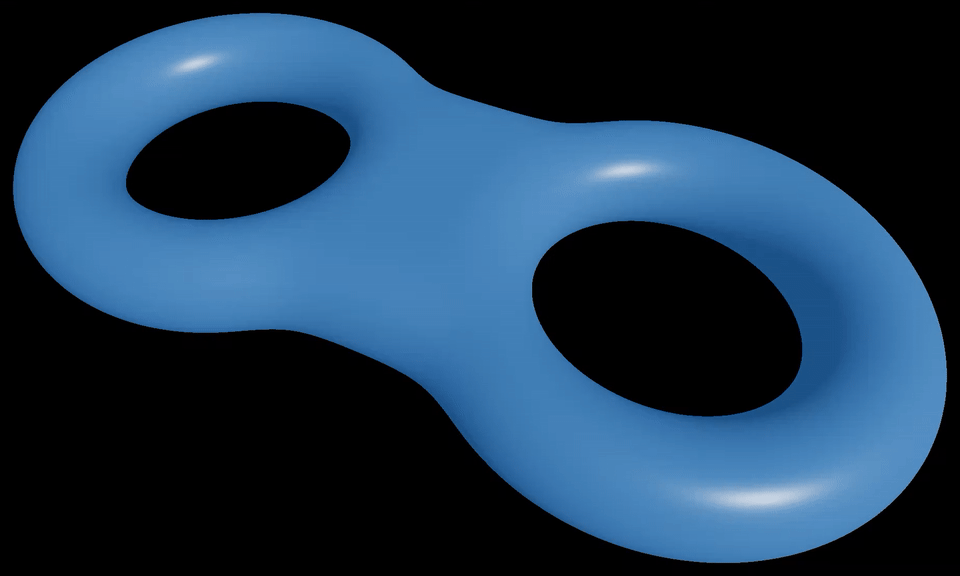</td>
    <td>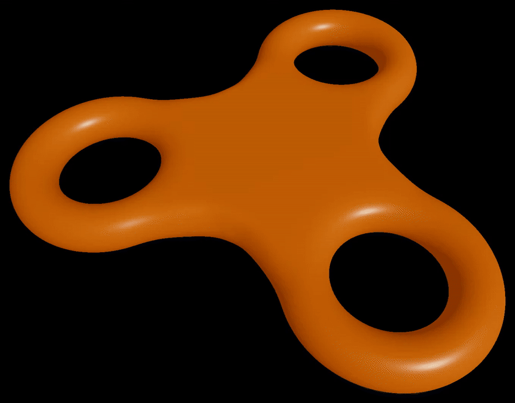</td>
  </tr>
</table>

## Motivation

This project grew out of visual material prepared for an award presentation following my master's thesis on the semistable reduction of plane quartics. The presentation was intended for a broad audience, including mathematicians without a background in algebraic geometry. Rather than leave the resulting 3D models unused, I developed them into this interactive visualizer for exploring the topology of stable genus-2 and genus-3 degenerations.

## Contents

- [Motivation](#motivation)
- [What the visualizer does](#what-the-visualizer-does)
- [How to use it](#how-to-use-it)
- [Topological description](#topological-description)
- [Algebraic-geometric interpretation](#algebraic-geometric-interpretation)
- [The genus-2 types](#the-genus-2-types)
- [The genus-3 types](#the-genus-3-types)
- [Why four loops and ten loops?](#why-four-loops-and-ten-loops)
- [How the visualization works](#how-the-visualization-works)
- [Run locally](#run-locally)
- [Project structure](#project-structure)
- [Documentation](#documentation)
- [References and credits](#references-and-credits)
- [License](#license)

## What the visualizer does

The application turns the combinatorics of stable curves into an interactive geometric picture. It lets you:

- explore all 7 genus-2 types and all 42 genus-3 types;
- move directly to a named type or play a configurable animated tour;
- contract loops manually and see the detected degeneration type update;
- highlight individual loops with a customizable, color-coded loop palette;
- follow, by continuous coloring, the regions that become normalized irreducible components in the limiting nodal curve;
- display the schematic curve and dual graph associated with the current type;
- rotate and zoom the 3D model;
- export transparent or custom-background PNG snapshots; and
- record a complete tour as a WebM video.

The application visualizes the **homeomorphism classes of stable curves over ℂ in the complex topology**, equivalently the isomorphism classes of their stable weighted dual graphs. It does not compute stable models from equations over valued fields. The 3D geometry is an explanatory model of the underlying topology: it suppresses the moduli of complex structures, the locations of the preimages of the nodes, and the complex plumbing parameters, and is not intended as a metric or conformal realization of a degenerating family.

## How to use it

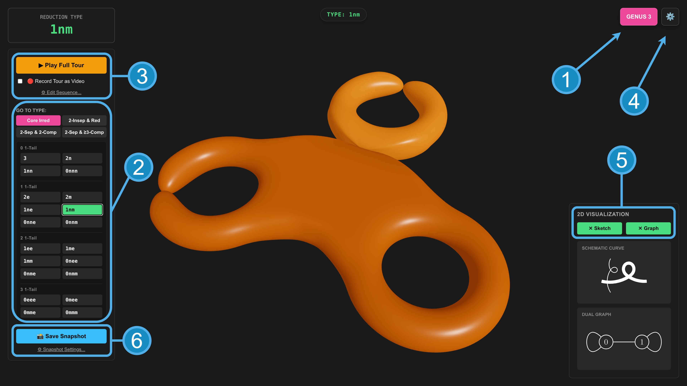

1. Use **GENUS 2 / GENUS 3** in the upper-right corner to switch models.
2. Select a type under **GO TO TYPE** to animate the surface to a nearest valid loop configuration representing that type.
3. Select **Play Full Tour** to visit the configured sequence automatically. You may change the sequence via **Edit Sequence...** and can also enable **Record Tour as Video** to save the run as a WebM file.
4. Open the settings panel to adjust contraction sliders, component colors, and loop highlighting.
5. Use **Sketch** and **Graph** to compare the 3D surface with its schematic curve and dual graph.
6. Use **Save Snapshot** to export the current view as a PNG. Open the settings below it to configure options like **Crop borders**, **Overlay label**, **Custom background**, or to embed 2D inlays (**Include curve sketch** / **Include dual graph**).

Some loops intersect and therefore cannot be contracted simultaneously. When a newly activated loop conflicts with an active one, the visualizer opens the incompatible loop automatically.

## Topological description

We first describe what the visualizer shows using only topology, without referring to algebraic geometry.

We start with a connected, closed, oriented surface, which from now on we shall simply call a **surface**. By the classification theorem for surfaces, such a surface is determined up to homeomorphism by a single integer $g \geq 0$, called its **genus**. Geometrically, the genus is the number of handles: the surface of genus 0 is the sphere, the surface of genus 1 is the familiar doughnut-shaped torus, and in general, a surface of genus $g$ is a sphere with $g$ handles.

Let $\Sigma_g$ be a surface of genus $g$. Choose a finite collection of pairwise disjoint simple closed curves on $\Sigma_g$, which we shall call **loops**. Imagine such a loop as a rope that can be tightened. We tighten it until the entire loop shrinks to a single point.

More formally, we take the quotient of $\Sigma_g$ by the equivalence relation that identifies all points on each chosen loop. The resulting space is called a **pinched surface**, and the points obtained by collapsing the loops are called its **nodes**.

For example, if $g=1$ and we collapse a loop going around the handle, the resulting space is called a [pinched torus](https://en.wikipedia.org/wiki/Pinched_torus).

A pinched surface is no longer a surface in the above sense because of its nodes, so it does not have a genus in the usual topological sense. If the pinched surface was obtained from a surface of genus $g$, we call $g$ its **arithmetic genus**. The genus formula below shows that the arithmetic genus can be recovered from the pinched surface itself.

### Geometric components of a pinched surface

Let $C$ be a pinched surface obtained from $\Sigma_g$, and remove all its nodes. The resulting space is a disjoint union of surfaces with finitely many punctures. Each node produces exactly two punctures in total, one for each of its two branches.

We now fill in every puncture by adding a single point. In this way, we obtain a finite collection of connected, closed surfaces

$$
C_1,\ldots,C_r.
$$

We call these the **geometric components** of the pinched surface. The points that were added are kept as distinguished points, and every node of the pinched surface corresponds to a pair of such points. The two points belonging to one node may lie on the same geometric component or on two different geometric components.

The genus $g_v$ of a geometric component $C_v$ is called its **geometric genus**.

For example, consider a pinched torus. After removing the node, we obtain a sphere with two punctures. Filling in these two punctures produces a sphere with two distinguished points. Thus the pinched torus has arithmetic genus 1, while its single geometric component has geometric genus 0.

### Schematic curves, the dual graph, and the genus formula

To a pinched surface, we associate a weighted graph $G$, called its **dual graph**, as follows:

- the vertices of $G$ are the geometric components;
- the weight of a vertex is the geometric genus of the corresponding component;
- every node gives an edge; and
- the endpoints of the edge indicate the geometric components containing the two distinguished points belonging to that node.

An edge may connect a vertex to itself. This happens when both distinguished points belonging to the node lie on the same geometric component. Such an edge is called a **loop edge**. Several edges may also join the same pair of vertices.

In algebraic and arithmetic geometry, it is also very common to draw **schematic curves** to represent this kind of data. In this standard 1-dimensional drawing convention, each line or curve segment represents a normalized irreducible component (a vertex in the dual graph), and the intersection points between these lines represent the nodes (the edges in the dual graph). Because these traditional line drawings do not inherently display the geometric genus of the components, this visualizer uses line thickness to represent it: the thinnest lines indicate geometric genus 0, with the thickness increasing step-by-step for higher genera. In the literature, it is also common to see the genus simply written as a number next to the respective component.

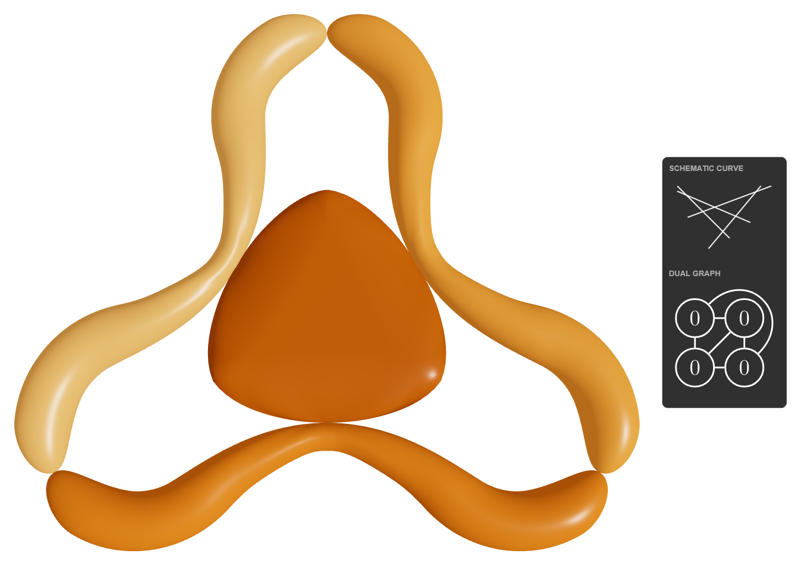

The arithmetic genus and the geometric genera are related by the formula

$$
g = \sum_{v\in V(G)} g_v + b_1(G).
$$

Here

$$
b_1(G) = |E(G)| - |V(G)| + 1
$$

is the first Betti number of the connected graph $G$, or equivalently its number of independent cycles.

It is a useful exercise to verify the genus formula in some examples and then prove it in general.

The formula shows that the arithmetic genus is distributed between the genera of the geometric components and the cycles in the dual graph. In particular, the total arithmetic genus is preserved when loops are pinched: handles that disappear from the geometric components reappear as cycles in the dual graph.

The weighted dual graph also completely determines the homeomorphism class of the pinched surface.

### Stability

For a fixed arithmetic genus $g$, there are infinitely many pinched surfaces, even up to homeomorphism.

To see this, begin with a surface $\Sigma_g$ and choose a simple closed curve that bounds an embedded disc. Pinching this loop produces a pinched surface with two geometric components: one homeomorphic to the surface with which we started and one sphere.

We may now choose another simple closed curve bounding a disc on this additional sphere and pinch it as well. Repeating the construction gives a geometric component homeomorphic to the original surface followed by a chain of spheres. Each intermediate sphere has two distinguished points arising from the nodes, while the final sphere has only one. In this way we obtain pinched surfaces of arithmetic genus $g$ with arbitrarily many geometric components. They are pairwise non-homeomorphic because they have different numbers of geometric components.

We therefore seek a minimality condition that forces the number of homeomorphism classes to be finite for fixed arithmetic genus; we call this condition **stability**. In the preceding example, all the additional geometric components have genus 0 and carry only one or two distinguished points, so such components should be excluded. There is an algebro-geometric reason for also requiring $g \geq 2$; this is explained more below.

A pinched surface of arithmetic genus $g$ is called **stable** if $g \geq 2$ and every geometric component of genus 0 contains at least three distinguished points arising from the nodes. When both branches of a node belong to the same geometric component, the corresponding two distinguished points are counted separately.

This stability condition ensures that, for each fixed arithmetic genus $g$, only finitely many homeomorphism classes remain.

[OEIS A174224](https://oeis.org/A174224) gives the number of homeomorphism classes of stable curves, i.e., of their underlying stable surfaces, for each arithmetic genus. In particular, there are 7 classes of arithmetic genus 2 and 42 classes of arithmetic genus 3.

## Algebraic-geometric interpretation

The preceding construction is purely topological. We now explain how it arises from stable complex curves.

### From a complex curve to its underlying surface

All curves represented by the visualizer are defined over ℂ. By a **smooth curve of genus $g$** we mean a smooth, projective, connected algebraic curve $C$ over ℂ. Its analytification $C^{\mathrm{an}}$ is a compact connected Riemann surface whose underlying topological surface is homeomorphic to $\Sigma_g$. The arithmetic genus defined via coherent sheaf cohomology, i.e., $p_a(C) = 1-\chi(\mathcal{O}_C)$, agrees with the number of handles of the underlying surface of $C^{\mathrm{an}}$.

The visualizer works with this underlying oriented topology. Every closed orientable surface admits an embedding in ℝ³, and the application chooses such an embedding as an illustrative model. This is not a holomorphic embedding of the original complex curve: the conformal structure, its moduli, and the algebraic equations have all been discarded.

### From a smooth fiber to a node

The contraction shown in the application is the topological shadow of a complex-analytic degeneration. The standard local analytic model for a smoothing of a node is

$$xy=t$$

For $t \neq 0$, the fiber is smooth near the origin and contains a narrow neck; as $t \to 0$, its vanishing cycle collapses. The central fiber $xy=0$ has an ordinary node, with the two coordinate axes as its local branches. In a proper flat family the arithmetic genus is constant, so a stable limit $C$ of a smooth curve of genus $g$ still has arithmetic genus $g$. The visualizer reflects this conservation law: a handle lost from a normalized component reappears as a cycle in the dual graph, and the total $\sum_v g_v+b_1(G)$ remains $g$. The 3D animation models the collapse of the underlying surface. It does not attempt to display the complex plumbing parameter $t$ or a complex-analytic embedding of the family.

### Algebraic normalization

At a node, two local analytic branches of the stable curve $C$ meet. The **normalization** $\nu: \widetilde{C} \to C$ separates them: the inverse image of each node consists of two distinct smooth points, one for each branch. Because $C$ is nodal, $\widetilde{C}$ is a disjoint union of smooth projective connected curves $\widetilde{C}_v$, one for each irreducible component of $C$.

The curves $\widetilde{C}_v$ are the **normalized irreducible components**. Their arithmetic genera $g_v$ are called their **geometric genera**. After forgetting the complex structures, the surfaces underlying the curves $\widetilde{C}_v$, together with the points lying above the nodes, are precisely the geometric components and distinguished points introduced in the topological description.

### Stable complex curves

For $g \geq 2$, a **stable curve** is a connected, projective, reduced complex curve $C$ of arithmetic genus $g$ whose only singularities are nodes and whose automorphism group is finite. Equivalently, its dualizing sheaf $\omega_C$ is ample.

If $g_v$ is the genus of $\widetilde{C}_v$ and $n_v$ is the number of points of $\widetilde{C}_v$ lying above the nodes, stability is equivalent to

$$
2g_v - 2 + n_v > 0
\qquad\text{for every } v.
$$

Here both preimages of a self-node are counted, so such a node contributes 2 to $n_v$. Thus a rational normalized component must carry at least three such points. A genus-1 component needs at least one, which is automatic here: if $n_v=0$, connectedness would force $C$ itself to be a smooth curve of genus 1, contrary to $g \geq 2$. A component of genus at least 2 is automatically stable. Consequently, for connected curves of arithmetic genus at least 2, this agrees with the topological stability condition above.

These are the standard Deligne--Mumford stable curves; see [Deligne--Mumford](https://www.numdam.org/item/PMIHES_1969__36__75_0/) and the Stacks Project sections on [nodal curves](https://stacks.math.columbia.edu/tag/0DSX) and [stable curves](https://stacks.math.columbia.edu/tag/0E73).

### Dual graph and homeomorphism class

The dual graph of the nodal curve is exactly the weighted graph defined topologically above: its vertices represent the normalized irreducible components, their weights are the geometric genera $g_v$, and its edges represent the nodes. The topological genus formula becomes the algebraic identity

$$
p_a(C) = h^1(C,\mathcal{O}_C) = \sum_{v\in V(G)} g_v + b_1(G).
$$

The stability inequality becomes the graph condition

$$
2g_v - 2 + \mathrm{val}(v) > 0,
$$

where a loop edge contributes 2 to the valence.

The **homeomorphism class** considered by the visualizer is simply the homeomorphism class of the underlying topological space of $C^{\mathrm{an}}$. For nodal complex curves, two such topological spaces are homeomorphic exactly when their weighted dual graphs are isomorphic. This does not mean that the curves are algebraically isomorphic: one homeomorphism class generally contains a positive-dimensional family of complex curves.

See also [*Semistable Reduction of Plane Quartics*](https://arxiv.org/abs/2511.15858), Section 2.1 ("Stable pointed curves") for a general overview, and Section 2.3 ("Stable curves of genus 3") for the specific organization and terminology of the genus 3 cases used here.


## The genus-2 types

The visualizer uses a compact notation designed to match the genus-3 naming convention (discussed in the next section). For genus 2, the notation can be read as follows:

- A number gives the geometric genus of a normalized component.
- The letter `n` records a node whose two branches lie on that same irreducible component (a self-node).
- The letter `e` denotes an **elliptic tail**, i.e., a smooth genus-1 component attached to the rest of the curve.
- The letter `m` denotes a **pig tail** (named after the terminology of multiplicative reduction), which is an irreducible rational component with one self-node. Its geometric genus is 0, but its arithmetic genus is 1.
- The symbol `---` means that the adjacent irreducible components meet in exactly three distinct nodes.

For example, the type `1n` is obtained by collapsing a non-separating loop on a smooth genus-2 surface. It has one geometric component of genus 1 and one node whose two distinguished points lie on that same component. Its dual graph therefore has one vertex of weight 1 and one loop edge, so the genus formula reads

$$2 = 1 + 1.$$

The first contribution is the geometric genus of the component, and the second is the first Betti number of the dual graph.

Arithmetic geometers might recognize the Roman numerals in the table below: these denote the potential stable-reduction types used by Qing Liu and Henri Cohen's `genus2reduction` program, as documented in the [SageMath reference manual](https://doc.sagemath.org/html/en/reference/arithmetic_curves/sage/interfaces/genus2reduction.html#sage.interfaces.genus2reduction.ReductionData).

| Visualizer | Liu type | Stable curve |
| :--- | :--- | :--- |
| `2` | Type I | A smooth genus-2 curve. |
| `1n` | Type II | An irreducible one-nodal curve whose normalization is a smooth projective genus-1 curve. |
| `0nn` | Type III | An irreducible rational curve with two nodes. |
| `0---0` | Type IV | Two rational components meeting transversely at three distinct nodes. |
| `ee` | Type V | Two smooth genus-1 components meeting transversely at one node. |
| `me` | Type VI | A smooth genus-1 component joined at one node to an irreducible rational component having a self-node. |
| `mm` | Type VII | Two irreducible rational components, each having a self-node, joined to each other at one additional node. |

Here a "genus-1 curve" does not by itself include a chosen origin; it becomes an elliptic curve only after such a point is chosen. For a genus-1 tail, the attaching point can provide that choice, but no group law is part of the homeomorphism classification. The four available genus-2 loops are `H1`, `H2`, `B`, and `E`; their geometric roles are [described below](#genus-2). Different valid subsets realize the seven homeomorphism classes, and several classes have more than one equivalent loop representation.

## The genus-3 types

The 42 genus-3 graph types are organized by their **core** and their **1-tails**. A 1-tail is an irreducible component of arithmetic genus 1 attached to the rest of the curve at a single node. If a genus-3 curve has $r$ such tails, one may normalize only at their attachment nodes while leaving all other nodes unchanged. This **partial normalization** detaches the tails and leaves a connected curve $C_c$ without so-called separating nodes (i.e., nodes whose removal disconnects the curve). This remaining curve is the core, and

$$p_a(C_c) = 3-r.$$

Each detached 1-tail has arithmetic genus 1, which explains the subtraction of $r$. These are [Definitions 2.33 and 2.36 and Lemma 2.35 in *Semistable Reduction of Plane Quartics*](https://arxiv.org/pdf/2511.15858#page=28). The same source calls the core **2-inseparable** when no pair of its nodes disconnects it after partial normalization, and **2-separable** otherwise. In the dual graph, this distinction asks whether there is a pair of edges whose simultaneous removal disconnects the graph although removing either edge alone does not; such a pair is called a **separating pair** ([Definition 2.17](https://arxiv.org/pdf/2511.15858#page=17)).

The compact naming convention used in that thesis largely follows the notation of [van Bommel, Docking, Lercier, and Lorenzo García](https://arxiv.org/abs/2401.13902). A name encodes the combinatorial structure of the curve:

- A number, `0`, `1`, `2`, or `3`, denotes an irreducible component of that **geometric genus**.
- The letter `n` appended to a genus, as in `0n`, records a node whose two branches lie on that irreducible component. It is a statement about the abstract nodal curve, not a self-intersection in a chosen ambient surface. Repetition records several such nodes: `1nn`, for example, has two.
- The letter `e` denotes an **elliptic tail**, the smooth possibility for a 1-tail; it has geometric genus 1.
- The letter `m` denotes a **pig tail**, named after multiplicative reduction: the other possibility for a 1-tail, namely an irreducible rational curve with one self-node. Its geometric genus is 0, but its arithmetic genus is 1.
- Symbols between component names record distinct nodes joining them: `=` means two nodes, `---` means three, and `----` means four.
- `Z` abbreviates the frequently occurring subconfiguration `0=0`, consisting of two rational components joined by two nodes. Whether the vertices are stable is determined using all incidences in the full graph.
- `CAVE` and `BRAID` are the two exceptional graph names used in the cited classification.

The following examples show how to translate a name directly into a dual graph:

| Name | Components and nodes | Dual-graph description |
| :--- | :--- | :--- |
| `2n` | One genus-2 component with one self-node | One vertex of weight 2 with one loop |
| `0nne` | One rational component with two self-nodes and one attached elliptic tail | A weight-0 vertex with two loops, joined by one edge to a weight-1 vertex |
| `1=0m` | A genus-1 component and a rational component meeting in two nodes, with a pig tail attached to the rational component | Weight-1 and weight-0 vertices joined by two parallel edges; the latter is joined by a bridge to a weight-0 vertex carrying a loop |

In this sense the labels are compressed descriptions of graphs rather than names for individual algebraic curves.

The interface groups the cases into four navigation families, following the terminology of the cited classification:

| Interface family | Types |
| :--- | :--- |
| Irreducible core | `3`, `2n`, `1nn`, `0nnn`, `2e`, `2m`, `1ne`, `1nm`, `0nne`, `0nnm`, `1ee`, `1me`, `1mm`, `0nee`, `0nme`, `0nmm`, `0eee`, `0mee`, `0mme`, `0mmm` |
| 2-inseparable and reducible core | `1---0`, `0---0n`, `0----0`, `CAVE`, `BRAID`, `0---0e`, `0---0m` |
| 2-separable, two-component core | `1=1`, `1=0n`, `0n=0n`, `1=0e`, `1=0m`, `0n=0e`, `0n=0m`, `0e=0e`, `0m=0e`, `0m=0m` |
| 2-separable, at least three components | `Z=1`, `Z=0n`, `Z=Z`, `Z=0e`, `Z=0m` |

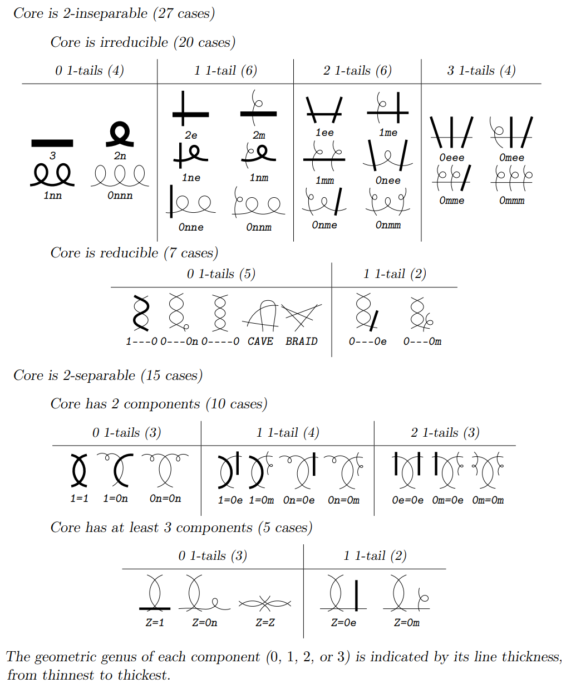

The 42 labels may equivalently be regarded as short names for the possible dual graphs. With the exception of the conventional names `CAVE` and `BRAID`, the symbols in a label encode the vertices, their genera, and the edges between them; the displayed dual graph presents the same information visually.

For a complete overview of all 42 cases, including schematic curve sketches for each type, see [Proposition 2.38 in *Semistable Reduction of Plane Quartics*](https://arxiv.org/pdf/2511.15858#page=30). Comparing those schematic 1D sketches with the interactive 3D topological surfaces in this visualizer is an excellent way to build geometric intuition for these degenerations.

## Why four loops and ten loops?

### From maximal degeneration to a pants decomposition

The genus-3 type `0mmm` shows the construction immediately. Choose six pairwise disjoint essential loops on the smooth genus-3 surface. There are two closely related operations one can perform on them:

- **cutting** along the loops produces four surfaces with boundary, each a pair of pants;
- **collapsing** each entire loop to a point produces six nodes and hence a maximally nodal stable curve.

The visualizer performs the second operation. The first explains the topology of the normalized components.

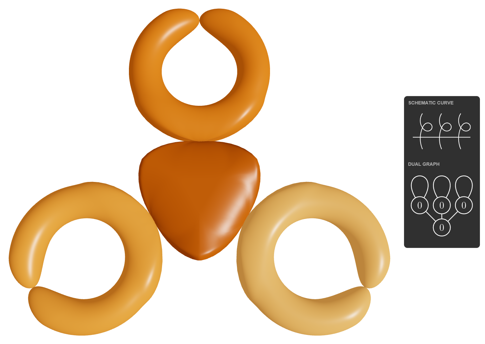

<table>
  <tr>
    <td>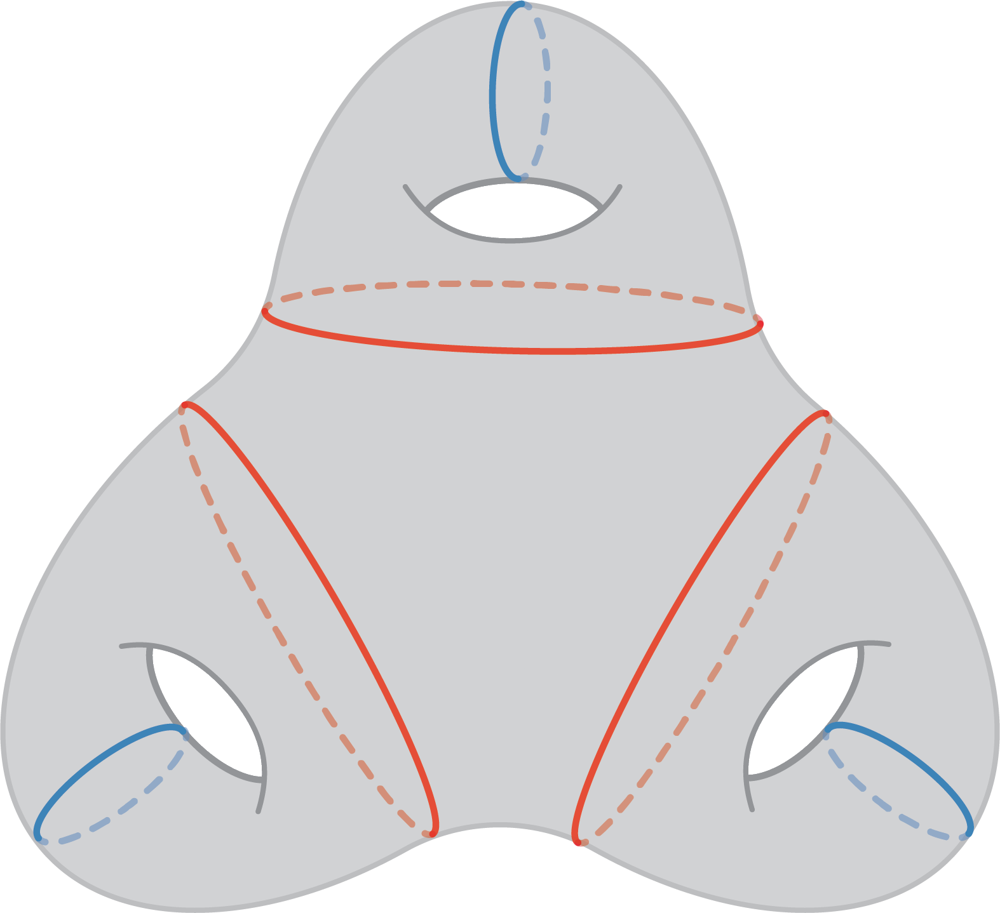</td>
    <td>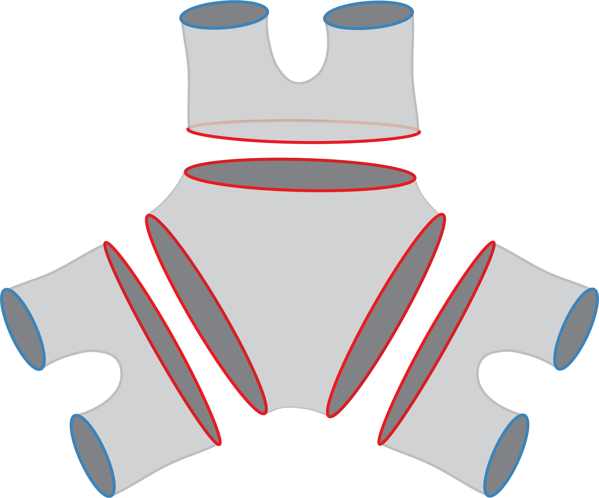</td>
  </tr>
</table>

The two drawings above are taken directly from slides 5 and 6 of [Fuladi, de Mesmay, and Parlier, *Universal families of arcs and curves on surfaces*](https://ci.labri.fr/uploads/Groupe/2022-2023/Fuladi_22-05-2023.pdf), presented at the LaBRI Combinatorics Seminar in May 2023.

A **pair of pants** is a compact sphere with the interiors of three disjoint closed discs removed; its interior is homeomorphic to the Riemann sphere with three points removed.

Here $\overline{\mathcal M}_g$ denotes the Deligne--Mumford compactification of the moduli space of smooth curves of genus $g$; its boundary parametrizes stable nodal curves, as in [Deligne--Mumford](https://www.numdam.org/item/PMIHES_1969__36__75_0/). A **maximally degenerate** (or maximally nodal) stable curve represents a zero-dimensional boundary stratum of $\overline{\mathcal M}_g$. Every normalized irreducible component is a projective line and contains exactly three points above the nodes. Its dual graph therefore has weight 0 at every vertex and is 3-regular; loops and multiple edges are allowed.

If $V$ is the number of normalized components and $E$ the number of nodes, trivalence and the genus formula give

$$
3V=2E,
\qquad
g=E-V+1.
$$

Solving yields

$$
V=2g-2,
\qquad
E=3g-3.
$$

The same numbers occur in a pants decomposition of the closed oriented surface $\Sigma_g$: cutting along $3g-3$ pairwise disjoint, pairwise non-isotopic essential simple closed curves gives $2g-2$ pairs of pants. These are the standard pants-decomposition counts used, for example, by [Fuladi, de Mesmay, and Parlier](https://arxiv.org/abs/2302.06336).

The relation with normalization can now be read in either direction. Normalizing a maximally nodal curve gives $2g-2$ projective lines, each with three distinguished points lying above the nodes. Removing small disjoint discs around those points turns each underlying sphere into a pair of pants. Conversely, pair the boundary circles according to the dual graph, glue each pair, and then collapse the glued circle to obtain the corresponding node. Thus a vertex of the trivalent dual graph represents a pair of pants, and an edge records the gluing of one boundary circle to another.

Thus, after complex structures and metric data are forgotten, a maximal degeneration, a pants decomposition up to homeomorphism, and a connected 3-regular multigraph encode the same incidence data. Pinching only a subset of the curves gives a less degenerate nodal curve with a different dual graph; conversely, any stable weighted graph can be refined to a trivalent graph of weight 0 by adding further pinches.

Following [Fuladi, de Mesmay, and Parlier](https://arxiv.org/abs/2302.06336), a finite collection $\Gamma$ of isotopy classes of essential simple closed curves on $\Sigma_g$ **realizes all types of pants decompositions** if, for every pants decomposition $P$, there is a self-homeomorphism $f:\Sigma_g\to\Sigma_g$ such that $f(P)\subseteq\Gamma$. We call such a $\Gamma$ a **universal family for pants decompositions**, and write $\Gamma(g)$ for the minimum possible cardinality. The curves in the full family may intersect; each realizing subset $f(P)$ consists of exactly $3g-3$ pairwise disjoint curves.

### Genus 2

For genus 2, there are two homeomorphism classes of pants decomposition, corresponding here to `mm` and `0---0`. The paper above depicts a four-curve family realizing both classes (Figure 1). Four is also minimal: a pants decomposition contains three curves, so a hypothetical three-curve universal family would itself have to represent both classes. That is impossible because one fixed multicurve has a single homeomorphism type. Hence

$$
\Gamma(2)=4.
$$

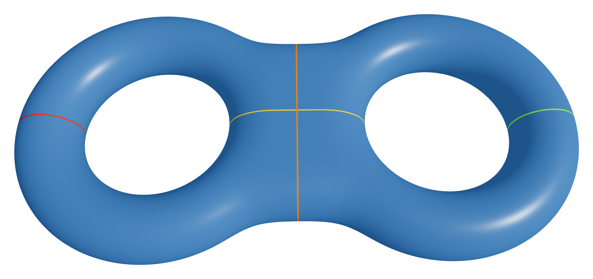

- `H1`, `H2`: handle loops;
- `B`: a loop passing through both handles; and
- `E`: a separating equator that cuts the surface into two genus-1 pieces.

### Genus 3

For genus 3, pants decompositions up to homeomorphism correspond to the five isomorphism classes of connected 3-regular multigraphs on four vertices, with loops allowed; compare [OEIS A005967](https://oeis.org/A005967). Each decomposition contains six curves. The visualizer uses the following family of ten:

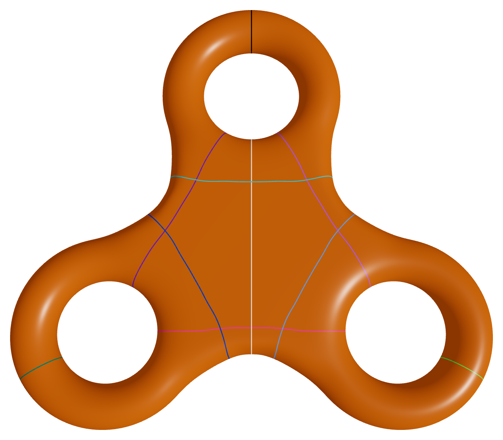

A visually matching ten-curve configuration appears on the title slide of the 2023 presentation cited above, without further discussion. It also appears in Figure 1.8 (p. 10) of [Niloufar Fuladi's 2023 PhD thesis, *Embedded Graphs: Crossings and Decompositions*](https://theses.hal.science/tel-04541476), whose caption states that the ten curves realize all pants-decomposition types of the closed orientable genus-3 surface, giving the upper bound $\Gamma(3)\leq 10$. The family used in this visualizer was found independently.

- `H1`, `H2`, `H3`: handle loops;
- `B12`, `B13`, `B23`: loops passing through the indicated pairs of handles;
- `E1`, `E2`, `E3`: separating equators; and
- `H1*`: the mirrored alternative to `H1`.

The five maximal types and one realizing subset for each are:

| Type | Six-loop subset |
| :--- | :--- |
| `0mmm` | `H1`, `H2`, `H3`, `E1`, `E2`, `E3` |
| `BRAID` | `H1`, `H2`, `H3`, `B12`, `B13`, `B23` |
| `Z=0m` | `H1`, `H2`, `H3`, `H1*`, `E3`, `B12` |
| `0m=0m` | `H1`, `H2`, `H3`, `H1*`, `E2`, `E3` |
| `Z=Z` | `H1`, `H2`, `H3`, `H1*`, `B12`, `B13` |

The corresponding pinched surfaces, schematic curves, and dual graphs are shown below.

<table>
  <tr>
    <th><code>0mmm</code></th>
    <th><code>BRAID</code></th>
    <th><code>Z=0m</code></th>
  </tr>
  <tr>
    <td></td>
    <td></td>
    <td>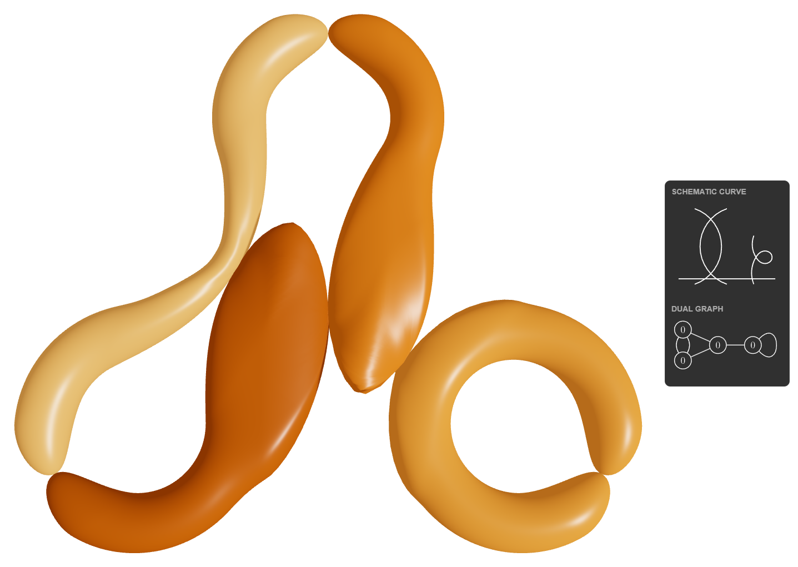</td>
  </tr>
  <tr>
    <th></th>
    <th><code>0m=0m</code></th>
    <th><code>Z=Z</code></th>
  </tr>
  <tr>
    <td></td>
    <td>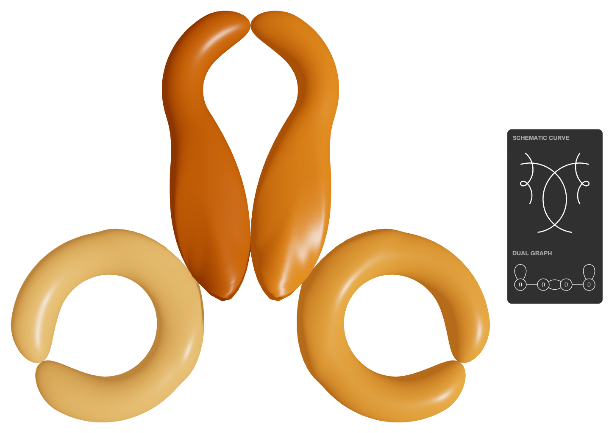</td>
    <td>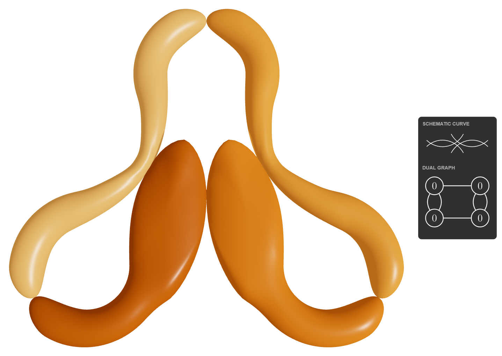</td>
  </tr>
</table>

### Theorem: $\Gamma(3)=10$

For the closed oriented surface $\Sigma_3$, the minimum defined above is

$$
\Gamma(3)=10.
$$

#### Proof

**Upper bound.** By construction, each six-curve subset in the table consists of pairwise disjoint curves, and the five resulting dual graphs exhaust the five homeomorphism classes. Therefore

$$
\Gamma(3)\leq 10.
$$

**Lower bound.** An essential simple closed curve is **separating** if its complement in $\Sigma_3$ is disconnected and **non-separating** otherwise. For a curve in a pants decomposition, this is equivalent to the corresponding edge of the dual graph being a bridge or a non-bridge, respectively.

The dual graph of `0mmm` has three bridges: a central vertex is joined to three outer vertices, each carrying a self-loop. Separating type is preserved by every self-homeomorphism of $\Sigma_3$, so any universal family must contain at least three separating curves.

The dual graph of `BRAID` is $K_4$. It has six edges and no bridges, so realizing `BRAID` requires six non-separating curves.

Assume for contradiction that a realizing family has cardinality at most 9. The preceding requirements already account for three separating and six non-separating curves, so the family has exactly nine curves of those respective kinds. Its `BRAID` subset must therefore consist of all six non-separating curves in the family.

Now consider `Z=Z`. Its 3-regular dual multigraph also has six edges and no bridges, but it is not isomorphic to $K_4$ (in particular, it has parallel edges). Realizing `Z=Z` would again require all six non-separating curves in the hypothetical family. This is impossible: one fixed six-curve multicurve has one dual graph up to isomorphism and therefore cannot represent both non-isomorphic pants-decomposition types.

Therefore six non-separating curves are insufficient. A universal family needs at least seven non-separating curves in addition to the three separating curves forced by `0mmm`. Hence

$$
\Gamma(3)\geq 3+7=10.
$$

Together with the explicit ten-loop construction, this proves $\Gamma(3)=10$. $\square$

## How the visualization works

### Shape-key deformation

The genus-2 and genus-3 surface models were built in Blender. Every contraction loop has a corresponding shape key in the exported GLB model. Moving a loop slider interpolates the relevant morph target from the smooth embedded model to a visually pinched configuration approximating the topological quotient in which that loop is collapsed. The resulting mesh is an illustration, not literally a singular complex algebraic curve.

Some simultaneous contractions need corrective shape keys where deformations overlap. These corrections keep the intersections geometrically coherent during animation.

### Topology and transitions

Genus 2 uses explicit four-bit loop states. When a type has several representations, the visualizer chooses the one closest to the current state.

Genus 3 enumerates the valid subsets of ten loops after excluding intersecting pairs. It classifies each valid subset into one of the 42 weighted-graph types and chooses a target with the smallest number of loop changes. Loops that must open are animated before newly required loops close.

### Continuous component coloring

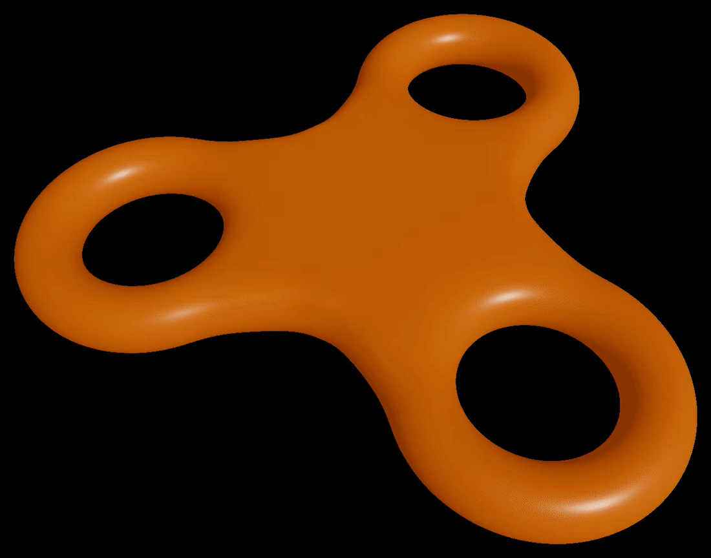

The animation follows the tour `3` → `0nnn` → `0---0n` → `Z=0n` → `Z=0m` → `3`. As the limiting normalization changes, component colors split, persist, and merge continuously.

The mesh is divided into named regions separated by the chosen contraction loops. From the active loop set, a combinatorial region graph computes which regions will belong to each normalized irreducible component of the limiting nodal type. The colors blend continuously as the sliders move. At an intermediate slider value the displayed mesh is generally still connected, so the colors should not be read as the connected components of an actual intermediate algebraic fiber.

Loop-marker colors are independent of component colors. They identify the ten named loops and do not encode the genus of a component.

### Schematic curves and dual graphs

The 2D schematic curves and dual graphs are generated from LaTeX sources. The curve sketches were prepared with [Hobby Editor](https://github.com/max-schwegele/hobby-editor). See the [diagram workflow documentation](./docs/workflows/diagrams.md) for the generation workflow.

## Run locally

You need a recent Node.js LTS release with npm.

```bash
git clone https://github.com/max-schwegele/stable-curves-visualizer.git
cd stable-curves-visualizer
npm install
npm run dev
```

Open the local address printed by Vite. To create and preview a production build:

```bash
npm run build
npm run preview
```

The GLB models must be present in `public/models/`, and the schematic-curve and dual-graph SVGs must be present in `public/diagrams/`.

## Project structure

```text
stable-curves-visualizer/
├── .github/
│   └── workflows/                # Automated GitHub Pages deployment
├── assets/
│   └── blender/                 # Editable Blender source files
├── docs/
│   ├── assets/
│   │   ├── blender/             # Blender workflow illustrations
│   │   ├── branding/            # Editable branding sources
│   │   └── readme/              # README images and animations
│   ├── diagram-sources/         # Editable LaTeX diagram sources
│   └── workflows/               # Blender and diagram-generation documentation
├── public/
│   ├── diagrams/                # Generated schematic-curve and dual-graph SVGs
│   │   ├── genus-2/
│   │   └── genus-3/
│   └── models/                  # GLB surface models loaded at runtime
├── scripts/
│   ├── blender/                 # Blender model-generation scripts
│   └── diagrams/                # SVG-generation script
├── src/
│   ├── app/                     # Application composition and responsive layout
│   ├── components/              # Reusable interface components
│   ├── features/
│   │   ├── camera/              # Camera presets and transitions
│   │   ├── export/              # Snapshot and video export
│   │   ├── genus2/              # Genus-2 controls, topology, and rendering
│   │   ├── genus3/              # Genus-3 controls, topology, and rendering
│   │   └── tour/                # Tour-sequence handling
│   ├── shared/                  # Shared hooks and utilities
│   ├── config.js
│   └── main.jsx
├── tests/                        # Unit tests for configuration and domain logic
├── LICENSE                       # MIT license for the software
├── LICENSE-MEDIA.md              # CC BY 4.0 terms for original media and documentation
├── README.md
├── THIRD_PARTY_NOTICES.md
├── package.json
└── vite.config.js
```

## Documentation

- [Blender workflow](./docs/workflows/blender.md): construction, segmentation, materials, shape keys, and GLB export.
- [LaTeX and SVG workflow](./docs/workflows/diagrams.md): schematic curves and dual graphs.
- [Semistable Reduction of Plane Quartics](https://arxiv.org/abs/2511.15858): mathematical context and the genus-3 classification convention.

## References and credits

### Mathematics

- Pierre Deligne and David Mumford, [*The irreducibility of the space of curves of given genus*](https://www.numdam.org/item/PMIHES_1969__36__75_0/), *Publications Mathématiques de l'IHÉS* **36** (1969), 75--109.
- [The Stacks Project, Section 109.18: Nodal curves](https://stacks.math.columbia.edu/tag/0DSX).
- [The Stacks Project, Section 109.22: Stable curves](https://stacks.math.columbia.edu/tag/0E73).
- [OEIS A174224](https://oeis.org/A174224): number of homeomorphism classes of stable curves, equivalently stable weighted graphs of type $(g,0)$.
- [OEIS A005967](https://oeis.org/A005967): isomorphism classes of connected 3-regular multigraphs, with loops allowed; its genus-3 entry gives the five maximal types used here.
- Max Schwegele, [*Semistable Reduction of Plane Quartics*](https://arxiv.org/abs/2511.15858), Master's thesis.
- Raymond van Bommel, Jordan Docking, Reynald Lercier, and Elisa Lorenzo García, [*Reduction of Plane Quartics and Dixmier-Ohno Invariants*](https://arxiv.org/abs/2401.13902).
- Niloufar Fuladi, Arnaud de Mesmay, and Hugo Parlier, [*Universal families of arcs and curves on surfaces*](https://arxiv.org/abs/2302.06336).
- Niloufar Fuladi, Arnaud de Mesmay, and Hugo Parlier, [*Universal families of arcs and curves on surfaces*](https://ci.labri.fr/uploads/Groupe/2022-2023/Fuladi_22-05-2023.pdf), presentation slides, LaBRI Combinatorics Seminar, May 2023.
- Niloufar Fuladi, [*Embedded Graphs: Crossings and Decompositions*](https://theses.hal.science/tel-04541476), PhD thesis, Université Gustave Eiffel, 2023, Figure 1.8 (p. 10).
- Qing Liu and Henri Cohen's genus-2 stable-reduction types, as documented by [SageMath `genus2reduction`](https://doc.sagemath.org/html/en/reference/arithmetic_curves/sage/interfaces/genus2reduction.html).

### Tools

The application uses React, Three.js, React Three Fiber, Drei, GSAP, and Leva. The 3D assets were created in Blender; the 2D mathematical illustrations were prepared in LaTeX with help from Hobby Editor.

## License

The software is licensed under the [MIT License](./LICENSE). Original documentation, 3D models, images, and animations by Max Schwegele are licensed under [Creative Commons Attribution 4.0 International](./LICENSE-MEDIA.md). The schematic-curve and dual-graph files incorporate third-party material and are excluded from those licenses; see [Third-party notices](./THIRD_PARTY_NOTICES.md).
