# 3D Modeling Workflow: Stable Curves Visualizer

> **Note:** This document provides a brief overview of how the 3D models for the visualizations were created. Keep in mind that I am a beginner in Blender, and this project was my first deep dive into 3D modeling and shape keys.

We use [Blender](https://www.blender.org/) to create the base 3D models of the genus-2 and genus-3 surfaces, and then use shape keys to model the different loop contractions (topological degenerations).

---

## 1. Genus 2 Surface

The core approach to creating this surface is to start with a flat, low-poly 2D base, extrude it into a 3D volume, and then smooth it using a Subdivision Surface modifier. Finally, we use shape keys combined with proportional editing to animate the topological pinches.

### 1.1 Generating the 2D Base
After experimenting with different layouts to find the most suitable topology, I wrote a short script that generates almost the entire 2D base automatically. You can run this directly in Blender's Scripting workspace.

```python
import math

import bmesh
import bpy
import mathutils


def generate_genus2_base():
    """Generate the planar low-poly starting mesh for the genus-2 surface."""

    object_name = 'Genus2_2D_Base'

    # Three concentric rings provide two quad strips across each handle. Their
    # outer boundaries are joined below to form the central bridge.
    radius = 1.0
    segments = 24
    ring_spacing = 0.0
    bridge_width_edges = 3

    x_offset = radius + ring_spacing / 2.0
    ring_centers = [
        mathutils.Vector((-x_offset, 0, 0)),
        mathutils.Vector((x_offset, 0, 0)),
    ]

    mesh = bpy.data.meshes.new(object_name)
    obj = bpy.data.objects.new(object_name, mesh)
    bpy.context.collection.objects.link(obj)
    bpy.context.view_layer.objects.active = obj
    obj.select_set(True)

    bm = bmesh.new()
    # Retain the outer rings because selected arcs on them become the bridge.
    outer_ring_vertices = []

    for center in ring_centers:
        outer_vertices = []
        middle_vertices = []
        inner_vertices = []

        for index in range(segments):
            angle = math.pi * 2 * index / segments
            direction = mathutils.Vector(
                (math.cos(angle), math.sin(angle), 0),
            )

            outer_vertices.append(
                bm.verts.new(direction * radius + center),
            )
            middle_vertices.append(
                bm.verts.new(direction * (radius * 0.75) + center),
            )
            inner_vertices.append(
                bm.verts.new(direction * (radius * 0.5) + center),
            )

        outer_ring_vertices.append(outer_vertices)

        for index in range(segments):
            next_index = (index + 1) % segments
            bm.faces.new(
                (
                    outer_vertices[index],
                    outer_vertices[next_index],
                    middle_vertices[next_index],
                    middle_vertices[index],
                ),
            )
            bm.faces.new(
                (
                    middle_vertices[index],
                    middle_vertices[next_index],
                    inner_vertices[next_index],
                    inner_vertices[index],
                ),
            )

    # bridge_edge_loops acts on the current mesh selection, so clear every
    # element before selecting the two opposing boundary arcs.
    for vertex in bm.verts:
        vertex.select = False
    for edge in bm.edges:
        edge.select = False
    for face in bm.faces:
        face.select = False

    bm.edges.ensure_lookup_table()

    # On the left handle, the arc around angle 0 points toward the center.
    for index in range(-bridge_width_edges, bridge_width_edges):
        ring_index = index % segments
        next_index = (index + 1) % segments
        edge = bm.edges.get(
            (
                outer_ring_vertices[0][ring_index],
                outer_ring_vertices[0][next_index],
            ),
        )
        if edge:
            edge.select = True

    # On the right handle, the opposing arc lies around angle pi.
    half_segments = segments // 2
    for index in range(
        half_segments - bridge_width_edges,
        half_segments + bridge_width_edges,
    ):
        ring_index = index % segments
        next_index = (index + 1) % segments
        edge = bm.edges.get(
            (
                outer_ring_vertices[1][ring_index],
                outer_ring_vertices[1][next_index],
            ),
        )
        if edge:
            edge.select = True

    bmesh.ops.recalc_face_normals(bm, faces=bm.faces)
    bm.to_mesh(mesh)
    bm.free()

    # The selected arcs survive the BMesh conversion and provide the two loops
    # consumed by Blender's bridge operator.
    bpy.ops.object.mode_set(mode='EDIT')
    bpy.ops.mesh.bridge_edge_loops(
        number_cuts=1,
        interpolation='LINEAR',
    )
    bpy.ops.object.mode_set(mode='OBJECT')


if __name__ == '__main__':
    generate_genus2_base()
```

The output generated by the script looks like this:

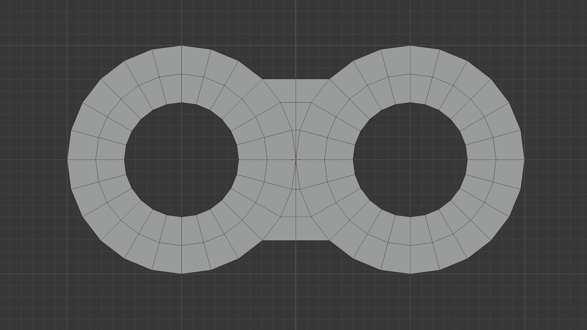

To ensure a clean edge flow, we manually refine this base. By dissolving the inner intersecting edges and inserting a straight cut (using the Knife tool or connecting the vertices via `J`), we fix the topology and end up with the following 2D base:


It is highly recommended to mark the loops that will later be contracted (pinched) as Seams. This makes selecting them much easier later on.

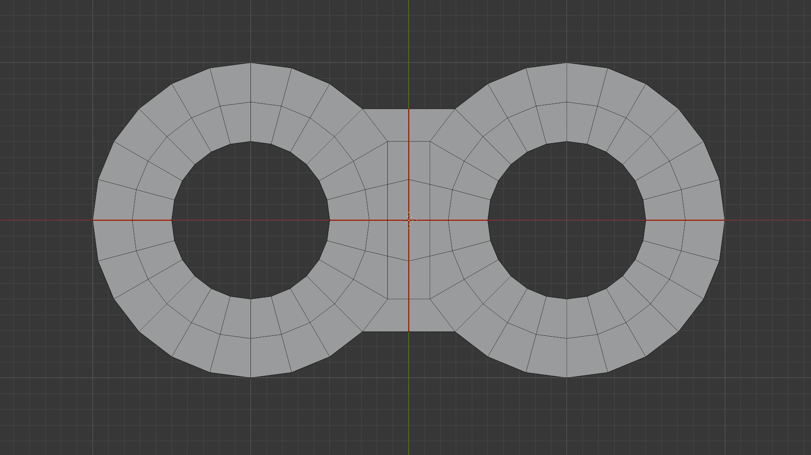

### 1.2 Extruding to 3D

Next, we turn this flat 2D layout into a 3D surface. We extrude the faces upwards, bisect the mesh in the middle to create an equator, and then shrink the top and bottom boundaries inward to form a rounded tube. 

> **Mathematical Note on the Extrusion:** 
> In the script below, the boundaries are shrunk inwards by `-0.10355`. 
> Since we extrude the mesh by `0.5`, our target tube radius is $r = 0.25$. To make the Subdivision Surface modifier closely approximate a circular cross-section, the control vertices need to form a regular octagon.
> The horizontal distance $d$ to pull in the top and bottom edges of an octagon relative to its center equator is mathematically defined as $d = r(\sqrt{2} - 1)$. 
> For our radius: $0.25 \times (\sqrt{2} - 1) \approx 0.10355$.

This entire process is fully automated via the following script:

```python
import bmesh
import bpy


def automate_2d_to_3d():
    """Turn the selected planar mesh into a rounded three-dimensional volume."""

    obj = bpy.context.active_object

    if not obj or obj.type != 'MESH':
        print('Error: Please select a 2D mesh object first!')
        return

    bpy.ops.object.mode_set(mode='OBJECT')
    bpy.ops.object.mode_set(mode='EDIT')
    bm = bmesh.from_edit_mesh(obj.data)

    # The later bisect operation creates additional boundary-like vertices. Keep
    # the original XY positions so only the genuine outer and inner rims move.
    # Rounding avoids mismatches caused by small floating-point differences.
    boundary_xy = set()
    for edge in bm.edges:
        if edge.is_boundary:
            for vertex in edge.verts:
                boundary_xy.add(
                    (round(vertex.co.x, 4), round(vertex.co.y, 4)),
                )

    faces = bm.faces[:]
    if not faces:
        print('Error: The mesh has no faces!')
        bpy.ops.object.mode_set(mode='OBJECT')
        return

    # An extrusion height of 0.5 gives the final tube a radius of 0.25.
    extrusion_result = bmesh.ops.extrude_face_region(bm, geom=faces)
    top_faces = [
        item
        for item in extrusion_result['geom']
        if isinstance(item, bmesh.types.BMFace)
    ]
    top_vertices = list(
        {vertex for face in top_faces for vertex in face.verts},
    )
    bmesh.ops.translate(
        bm,
        vec=(0, 0, 0.5),
        verts=top_vertices,
    )

    z_coordinates = [vertex.co.z for vertex in bm.verts]
    z_min = min(z_coordinates)
    z_max = max(z_coordinates)
    z_mid = (z_max + z_min) / 2.0

    # Bisecting halfway through the extrusion creates the equatorial control
    # ring required for a nearly circular subdivided cross-section.
    geometry = bm.verts[:] + bm.edges[:] + bm.faces[:]
    bmesh.ops.bisect_plane(
        bm,
        geom=geometry,
        dist=0.0001,
        plane_co=(0, 0, z_mid),
        plane_no=(0, 0, 1),
        clear_inner=False,
        clear_outer=False,
    )

    bmesh.ops.recalc_face_normals(bm, faces=bm.faces)

    boundary_vertices = []
    for vertex in bm.verts:
        is_top_or_bottom = (
            abs(vertex.co.z - z_min) < 0.001
            or abs(vertex.co.z - z_max) < 0.001
        )
        vertex_xy = (
            round(vertex.co.x, 4),
            round(vertex.co.y, 4),
        )

        if is_top_or_bottom and vertex_xy in boundary_xy:
            boundary_vertices.append(vertex)

    # For radius r = 0.25, r * (sqrt(2) - 1) is approximately 0.10355.
    # Moving the top and bottom rims inward by this amount produces the control
    # vertices of a regular octagonal cross-section before subdivision.
    boundary_offset = -0.10355
    for vertex in boundary_vertices:
        vertex.co += vertex.normal * boundary_offset

    bmesh.update_edit_mesh(obj.data)
    bpy.ops.object.mode_set(mode='OBJECT')

    for polygon in obj.data.polygons:
        polygon.use_smooth = True

    # Keep the modifier unapplied so the resulting topology can be inspected
    # before the dense mesh is created for shape-key editing.
    modifier_name = 'Subdivision'
    if modifier_name not in obj.modifiers:
        modifier = obj.modifiers.new(
            name=modifier_name,
            type='SUBSURF',
        )
    else:
        modifier = obj.modifiers[modifier_name]

    modifier.levels = 3
    modifier.render_levels = 3


if __name__ == '__main__':
    automate_2d_to_3d()
```

The output of the script looks like this (viewed in Object Mode with Wireframe overlay):

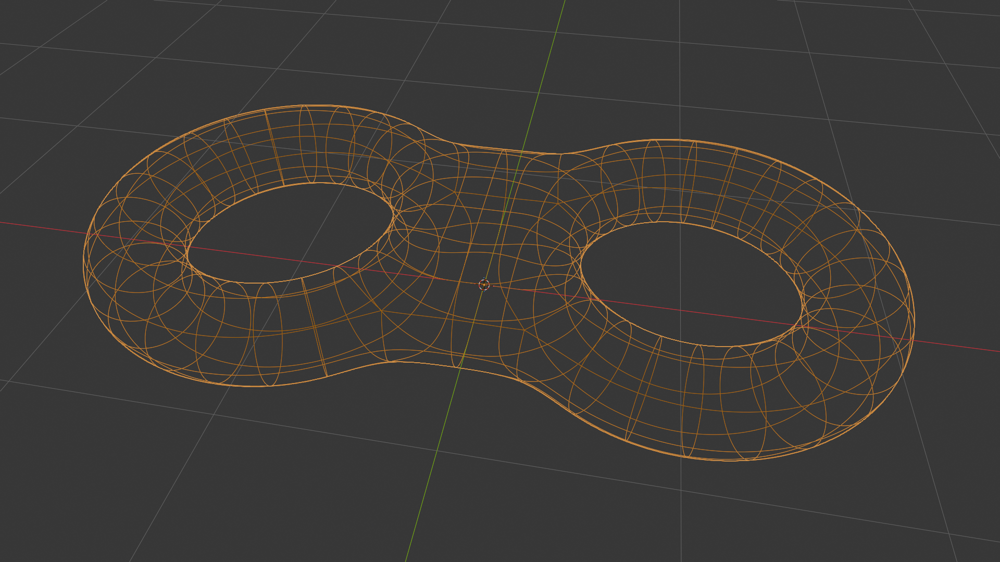

Note that the Subdivision Surface modifier is added but not yet applied automatically by the script. Apply it manually now (hover over the modifier and press `Ctrl + A`). We now have a nice genus 2 surface with a clean, dense topology:

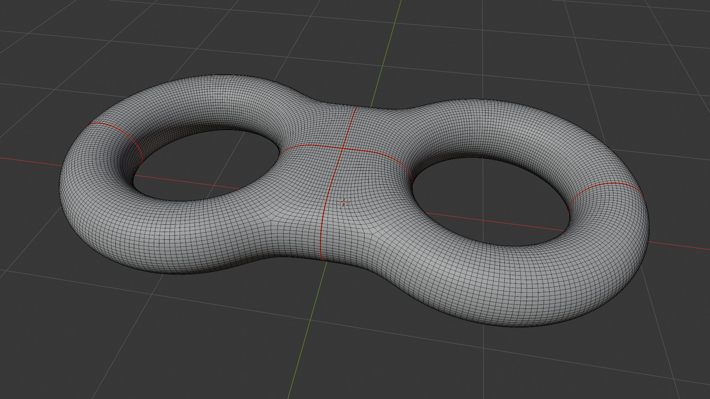

### 1.3 Beveling and Regions

Switch to **Edit Mode** (`Tab`), change to **Edge Select** mode (`2`), and select all our previously marked seams. Press `Ctrl + B` to bevel and type `0.005`. Since Blender bevels in both directions, this gives our loops a total uniform width of exactly `0.01`. The output looks like this:

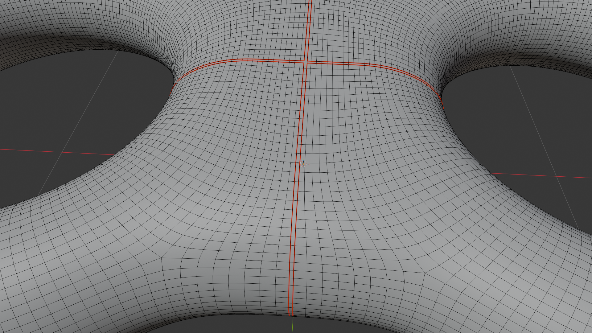

It is highly convenient to add some extra seams at the places where two loops intersect (which happens in two places in our Genus 2 case). Add these short intersection seams as shown below:

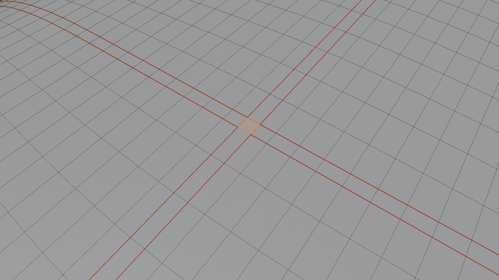

These seams cleanly divide our surface into distinct topological regions. In the React application later on, we want to color these regions dynamically based on the topological state. To prepare for this, we set up a distinct **Material** for each region and loop. 

The colors shown in the following tables are temporary identification colors used while authoring the mesh. Runtime component and loop-marker colors are configured separately in the application.

We use the following naming convention:

### Regions

| Color | Name | Position |
| :---: | :--- | :--- |
| ${\Large\color{#C02020}\blacksquare}$ | `Region_TL` | Top Left |
| ${\Large\color{#2040C0}\blacksquare}$ | `Region_TR` | Top Right |
| ${\Large\color{#D9A600}\blacksquare}$ | `Region_BL` | Bottom Left |
| ${\Large\color{#208030}\blacksquare}$ | `Region_BR` | Bottom Right |

### Loops

| Color | Name | Position |
| :---: | :--- | :--- |
| ${\Large\color{#30C0E0}\blacksquare}$ | `Loop_H1` | Left Handle |
| ${\Large\color{#990099}\blacksquare}$ | `Loop_H2` | Right Handle |
| ${\Large\color{#C06000}\blacksquare}$ | `Loop_E_T` | Top part of E |
| ${\Large\color{#500080}\blacksquare}$ | `Loop_E_B` | Bottom part of E |
| ${\Large\color{#708020}\blacksquare}$ | `Loop_B_L` | Left part of B |
| ${\Large\color{#B04060}\blacksquare}$ | `Loop_B_R` | Right part of B |
| ${\Large\color{#402010}\blacksquare}$ | `Loop_B_E` | Intersection of B and E |

> **Pro Tip for selecting regions:** To quickly select an entire region bounded by seams, stay in Edit Mode, switch to **Face Select** mode (`3`), hover your mouse over the desired area, and press **`L`** (Select Linked).

Create a new Material for each of the names listed above and assign it to the corresponding faces. Here is an overview of all the different regions marked on the mesh:

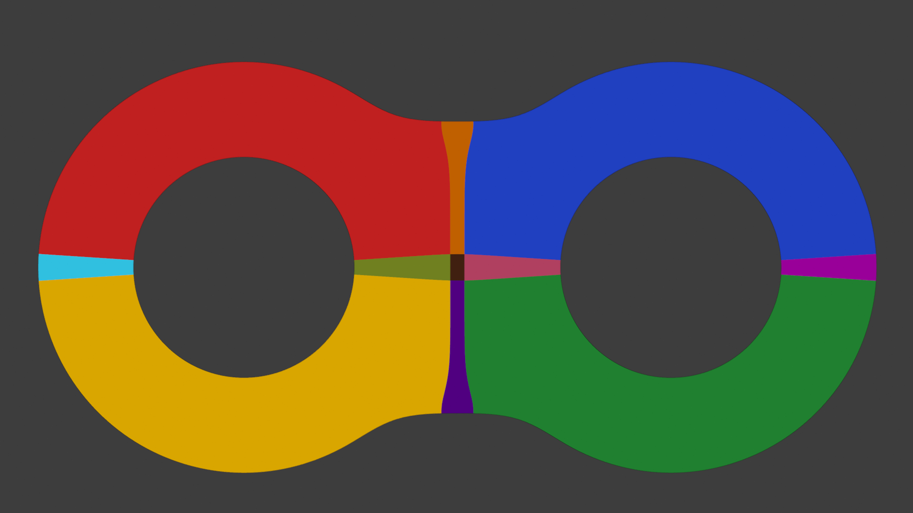

*(Note: The layout is symmetrical top-to-bottom. The only region that is not topologically connected is `Loop_B_E`, which consists of two small square patches at the top and bottom intersections).*

### 1.4 Shape Keys (Pinching)

We use shape keys to animate the pinching of the curves. In the Object Data Properties tab, first create a **Basis** shape key, followed by four additional shape keys named as follows:
* **Handles:** `H1`, `H2`
* **Equator:** `E`
* **Bridge:** `B`

*(See the README for a detailed description of this naming convention).*

The process for creating the pinch effect is identical for all four loops. For example, to create the pinch for `H1`: 

1. Select the `H1` shape key and enter **Edit Mode** (`Tab`).
2. Select all faces of the thickened `H1` loop (which is conveniently enclosed by the seams we marked earlier).
3. Set the Transform Pivot Point to **Median Point**.
4. Activate **Proportional Editing** (press `O`) and change the falloff profile to **Sharp**.
5. Press `S` to scale, type exactly `0.01` on your keyboard, scroll your mouse wheel to adjust the proportional size to exactly `0.5`, and hit `Enter`. 

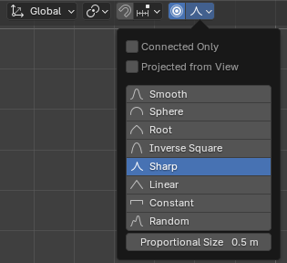

This creates a smooth, topological contraction that pulls the surrounding geometry with it, reducing the loop to almost a single point. It should yield the following result:

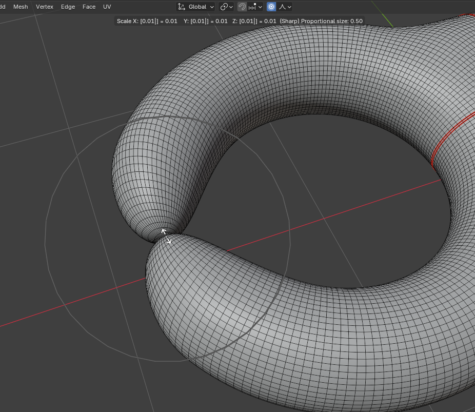

Repeat this exact process for the `H2`, `E`, and `B` shape keys. 

By dynamically combining and blending these shape keys later, we can smoothly interpolate to any stable curve type in the web app.


### 1.5 Exporting to GLB

To use the model in our React Three Fiber application, we need to export it as a binary glTF file (`.glb`). 

1. In **Object Mode**, select your finished Genus 2 surface.
2. Go to **File > Export > glTF 2.0 (.glb/.gltf)**.
3. The default export settings are mostly fine. Just double-check that **Selected Objects** (under *Include*) and **Shape Keys** (at the bottom) are checked!
4. Name your file (e.g., `surface_g2.glb`) and save it.

---

## 2. Genus 3 Surface

The strategy for the Genus 3 surface is almost identical, but with added topological complexity due to the complex central region, where several loops lie very close together. This requires a programmatic fix for overlapping shape key deformations.

### 2.1 Generating the 2D Base

We begin by building a flat 2D base. We use the same concentric ring structure as in the Genus 2 case, but this time with three rings placed symmetrically (at 120-degree intervals) around the origin. 

The following script automates the generation of this layout.

```python
import math

import bmesh
import bpy
import mathutils


def generate_genus3_base():
    """Generate the planar low-poly starting mesh for the genus-3 surface."""

    object_name = 'Genus3_2D_Base'

    # The three handles are copies of the same concentric-ring mesh, positioned
    # symmetrically around the origin at 120-degree intervals.
    radius = 1.0
    distance_factor = 1.7
    center_distance = distance_factor * radius
    segments = 24

    # Each outer ring receives a flat inward extension. These extensions are
    # connected manually in Blender to produce the final central region.
    extrude_distance = 0.0
    extension_edges_left = 4
    extension_edges_right = 4

    flat_edge_y = center_distance - radius - extrude_distance
    bottom_index = int(segments * 0.75)
    start_index = bottom_index - extension_edges_left

    mesh = bpy.data.meshes.new(object_name)
    obj = bpy.data.objects.new(object_name, mesh)
    bpy.context.collection.objects.link(obj)
    bpy.context.view_layer.objects.active = obj
    obj.select_set(True)

    bm = bmesh.new()

    for handle_index in range(3):
        angle_offset = math.radians(handle_index * 120)
        # Build one handle in a local upward orientation, then rotate the whole
        # construction into its final position.
        rotation = mathutils.Matrix.Rotation(angle_offset, 4, 'Z')

        outer_vertices = []
        middle_vertices = []
        inner_vertices = []

        for index in range(segments):
            angle = math.pi * 2 * index / segments
            direction = mathutils.Vector(
                (math.cos(angle), math.sin(angle), 0),
            )
            center = mathutils.Vector((0, center_distance, 0))

            outer_vertices.append(
                bm.verts.new(rotation @ (direction * radius + center)),
            )
            middle_vertices.append(
                bm.verts.new(
                    rotation @ (direction * (radius * 0.75) + center),
                ),
            )
            inner_vertices.append(
                bm.verts.new(
                    rotation @ (direction * (radius * 0.5) + center),
                ),
            )

        for index in range(segments):
            next_index = (index + 1) % segments
            bm.faces.new(
                (
                    outer_vertices[index],
                    outer_vertices[next_index],
                    middle_vertices[next_index],
                    middle_vertices[index],
                ),
            )
            bm.faces.new(
                (
                    middle_vertices[index],
                    middle_vertices[next_index],
                    inner_vertices[next_index],
                    inner_vertices[index],
                ),
            )

        # Flatten the vertices nearest the origin so the three extensions have
        # compatible boundaries for the subsequent manual fill operation.
        flat_vertices = {}
        extension_length = extension_edges_left + extension_edges_right

        for step in range(extension_length + 1):
            index = (start_index + step) % segments
            angle = math.pi * 2 * index / segments
            flat_position = mathutils.Vector(
                (math.cos(angle) * radius, flat_edge_y, 0),
            )
            flat_vertices[index] = bm.verts.new(rotation @ flat_position)

        for step in range(extension_length):
            index = (start_index + step) % segments
            next_index = (index + 1) % segments
            bm.faces.new(
                (
                    outer_vertices[index],
                    outer_vertices[next_index],
                    flat_vertices[next_index],
                    flat_vertices[index],
                ),
            )

    bmesh.ops.recalc_face_normals(bm, faces=bm.faces)
    bm.to_mesh(mesh)
    bm.free()


if __name__ == '__main__':
    generate_genus3_base()
```

The output generated by the script looks like this:

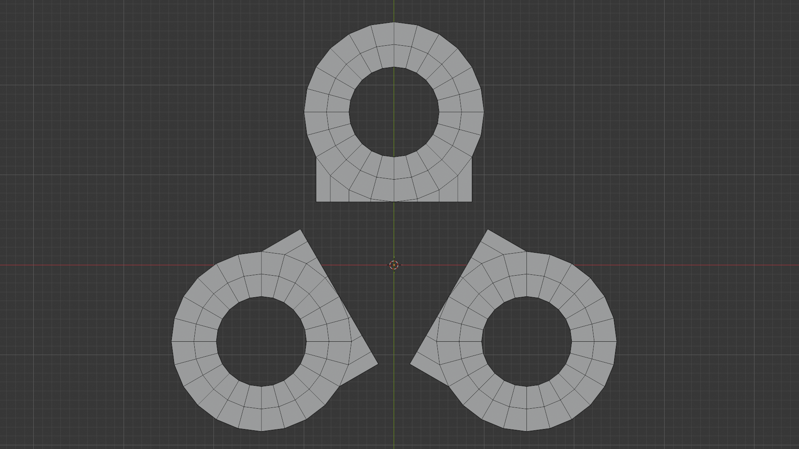

The center gap is first filled manually by connecting the three extruded parts. You can use a combination of the **Bridge Edge Loops** tool, the standard **Fill** command (`F`), and the **Knife Tool** (`K`) to create the initial geometry. At this stage, the center is closed, but the topology contains some unnecessary edges:

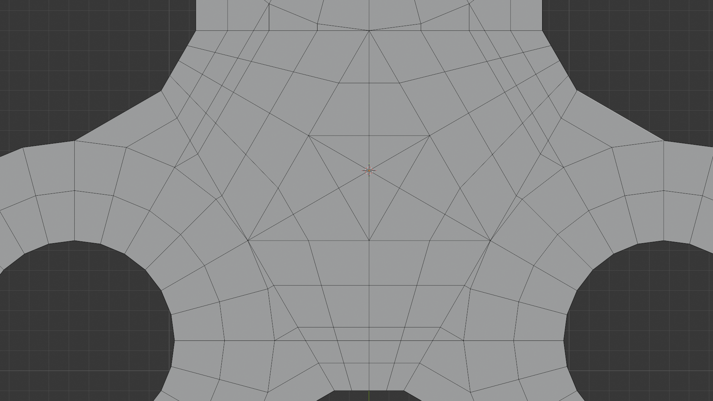

Next, we clean up the topology by dissolving some edges which are unwanted:

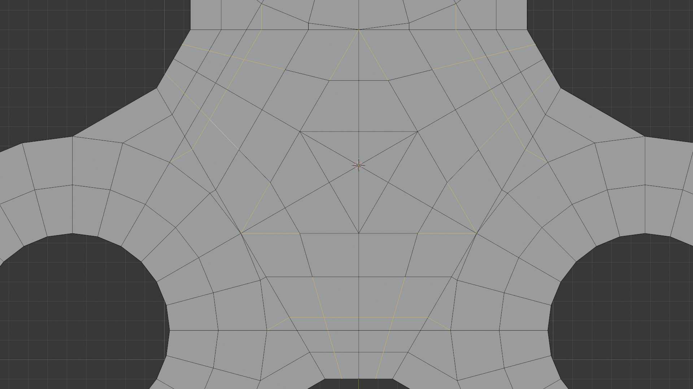

The final, refined 2D base should look exactly like this:

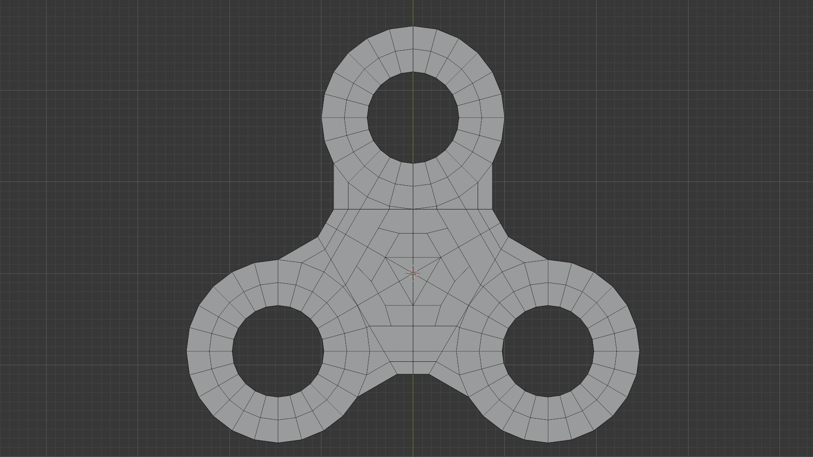

Just like in the Genus 2 workflow, we mark the edge loops that will later be contracted (pinched) as **Seams**. This makes selecting the different topological regions significantly easier later on.

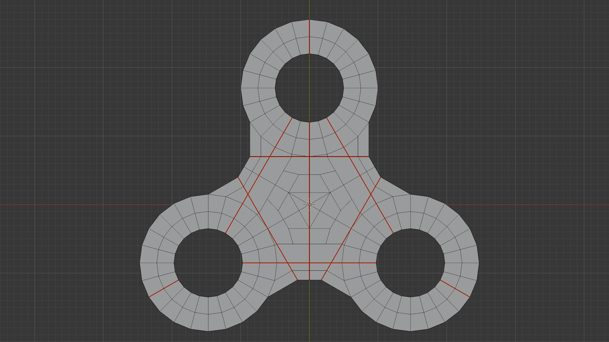

### 2.2 Extruding to 3D

The process for extruding the geometry is exactly the same as before. The Python script we used in the Genus 2 workflow is general enough to be applied directly to this new 2D base. 

Simply run the script. The output will look like this (viewed in Object Mode with the Wireframe overlay enabled):

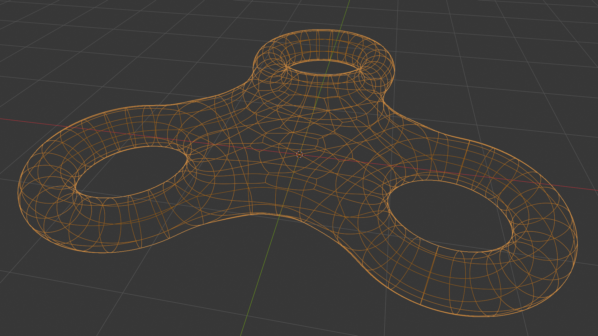

Just like before, manually apply the Subdivision Surface modifier (`Ctrl + A`). We now have a smooth Genus 3 surface with a clean topology:

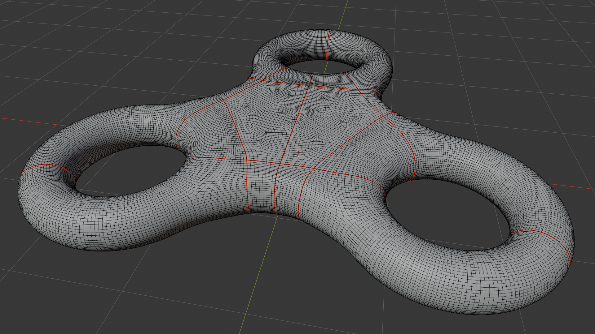

### 2.3 Beveling and Regions

Exactly as in the Genus 2 case, thicken the loops by selecting all 10 of our previously marked seams. Press `Ctrl + B` to bevel and set the width to `0.005`. The output looks like this:

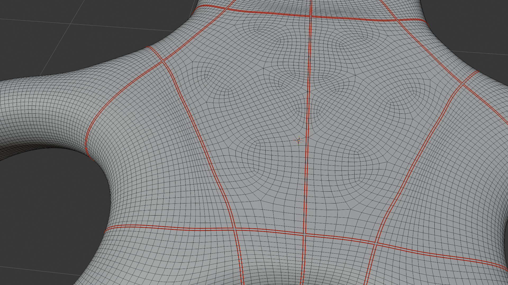

We now place some extra seams at the places where two loops intersect. There are exactly 16 places where this happens. Here are the 8 places marked on the top (the other 8 are located symmetrically on the bottom side):

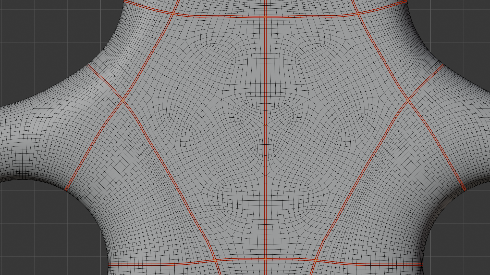

These seams cleanly divide our surface into distinct topological regions. We again set up distinct **Materials** for each region and loop in order to have full coloring control in the web application later. We have exactly 16 non-loop regions, and the 10 main loops are overall divided into 34 distinct "loop parts" (including the intersection overlaps).

To keep the visual overview clear, we render the regions and the loops in two separate images. We group related areas into color families (e.g., all 'D' regions are shades of blue) to make the complex topology easier to understand.

Here is the color-coded overview for the regions:

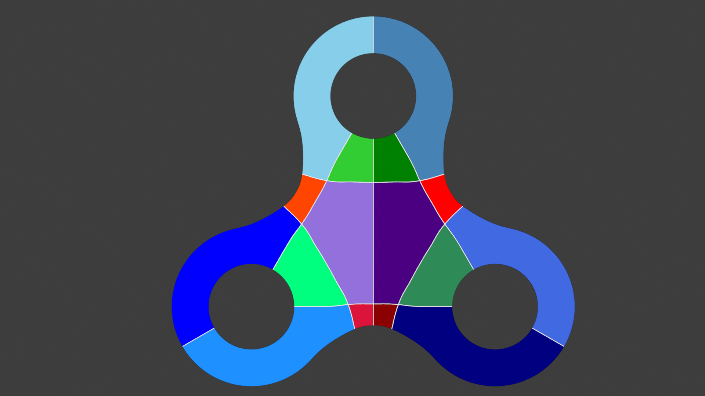

### Regions

| Color | Name |
| :---: | :--- |
| ${\Large\color{#87CEEB}\blacksquare}$ | `Region_D1_A` |
| ${\Large\color{#4682B4}\blacksquare}$ | `Region_D1_B` |
| ${\Large\color{#1E90FF}\blacksquare}$ | `Region_D2_A` |
| ${\Large\color{#0000FF}\blacksquare}$ | `Region_D2_B` |
| ${\Large\color{#4169E1}\blacksquare}$ | `Region_D3_A` |
| ${\Large\color{#000080}\blacksquare}$ | `Region_D3_B` |
| ${\Large\color{#32CD32}\blacksquare}$ | `Region_I1_A` |
| ${\Large\color{#008000}\blacksquare}$ | `Region_I1_B` |
| ${\Large\color{#00FF7F}\blacksquare}$ | `Region_I2` |
| ${\Large\color{#2E8B57}\blacksquare}$ | `Region_I3` |
| ${\Large\color{#FF4500}\blacksquare}$ | `Region_O12` |
| ${\Large\color{#FF0000}\blacksquare}$ | `Region_O13` |
| ${\Large\color{#DC143C}\blacksquare}$ | `Region_O23_A` |
| ${\Large\color{#8B0000}\blacksquare}$ | `Region_O23_B` |
| ${\Large\color{#9370DB}\blacksquare}$ | `Region_M_A` |
| ${\Large\color{#4B0082}\blacksquare}$ | `Region_M_B` |

And here is the corresponding color-coded overview for the loops (including intersections):

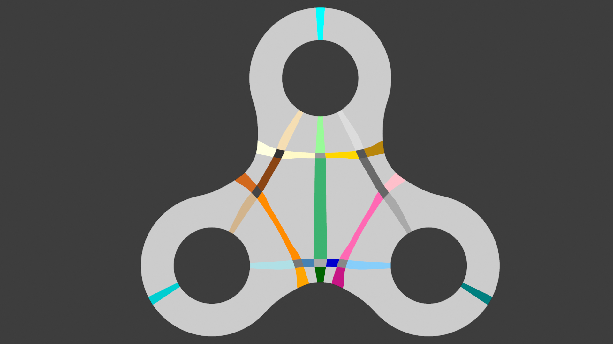

### Loops

| Color | Name |
| :---: | :--- |
| ${\Large\color{#00FFFF}\blacksquare}$ | `Loop_H1` |
| ${\Large\color{#00CED1}\blacksquare}$ | `Loop_H2` |
| ${\Large\color{#008080}\blacksquare}$ | `Loop_H3` |
| ${\Large\color{#FFFFE0}\blacksquare}$ | `Loop_E1_O12` |
| ${\Large\color{#FFFAC8}\blacksquare}$ | `Loop_E1_I1A` |
| ${\Large\color{#FFD700}\blacksquare}$ | `Loop_E1_I1B` |
| ${\Large\color{#B8860B}\blacksquare}$ | `Loop_E1_O13` |
| ${\Large\color{#FFA500}\blacksquare}$ | `Loop_E2_O23` |
| ${\Large\color{#FF8C00}\blacksquare}$ | `Loop_E2_I2` |
| ${\Large\color{#D2691E}\blacksquare}$ | `Loop_E2_O12` |
| ${\Large\color{#FFC0CB}\blacksquare}$ | `Loop_E3_O13` |
| ${\Large\color{#FF69B4}\blacksquare}$ | `Loop_E3_I3` |
| ${\Large\color{#C71585}\blacksquare}$ | `Loop_E3_O23` |
| ${\Large\color{#F5DEB3}\blacksquare}$ | `Loop_B12_I1` |
| ${\Large\color{#D2B48C}\blacksquare}$ | `Loop_B12_I2` |
| ${\Large\color{#8B4513}\blacksquare}$ | `Loop_B12_C` |
| ${\Large\color{#DCDCDC}\blacksquare}$ | `Loop_B13_I1` |
| ${\Large\color{#A9A9A9}\blacksquare}$ | `Loop_B13_I3` |
| ${\Large\color{#696969}\blacksquare}$ | `Loop_B13_C` |
| ${\Large\color{#B0E0E6}\blacksquare}$ | `Loop_B23_I2` |
| ${\Large\color{#87CEFA}\blacksquare}$ | `Loop_B23_I3` |
| ${\Large\color{#4682B4}\blacksquare}$ | `Loop_B23_CA` |
| ${\Large\color{#0000CD}\blacksquare}$ | `Loop_B23_CB` |
| ${\Large\color{#98FB98}\blacksquare}$ | `Loop_H1s_I1` |
| ${\Large\color{#3CB371}\blacksquare}$ | `Loop_H1s_M` |
| ${\Large\color{#006400}\blacksquare}$ | `Loop_H1s_O23` |
| ${\Large\color{#333333}\blacksquare}$ | `Loop_B12_E1` (Intersection) |
| ${\Large\color{#444444}\blacksquare}$ | `Loop_B12_E2` (Intersection) |
| ${\Large\color{#555555}\blacksquare}$ | `Loop_B13_E1` (Intersection) |
| ${\Large\color{#666666}\blacksquare}$ | `Loop_B13_E3` (Intersection) |
| ${\Large\color{#777777}\blacksquare}$ | `Loop_B23_E2` (Intersection) |
| ${\Large\color{#888888}\blacksquare}$ | `Loop_B23_E3` (Intersection) |
| ${\Large\color{#999999}\blacksquare}$ | `Loop_H1s_E1` (Intersection) |
| ${\Large\color{#AAAAAA}\blacksquare}$ | `Loop_H1s_B23` (Intersection) |

> **Pro Tip for selecting regions:** To quickly select an entire region bounded by seams, stay in Edit Mode, switch to **Face Select** mode (`3`), hover your mouse over the desired area, and press **`L`** (Select Linked).

Create a new Material for each of the names listed above and assign it to the corresponding faces.

### 2.4 Shape Keys (Pinching)

Create the shape keys using exactly the same Proportional Editing method as in the Genus 2 case. Apart from the **Basis** key, we now need to create the following 10 shape keys for the different loops:

* **Handles:** `H1`, `H2`, `H3`
* **Equators:** `E1`, `E2`, `E3`
* **Bridges:** `B12`, `B13`, `B23`
* **Mirrored:** `H1*`

*(See the README for a detailed description of this naming convention).* 

By dynamically combining and blending these shape keys later, we can smoothly interpolate to any stable curve type in the web application. It is a fun little challenge to figure out exactly which shape key configurations correspond to which stable curve type (feel free to check the source code for the answers!).

### 2.5 The Shape Key Overlap Problem (Corrective Shape Keys)

Topological compatibility is determined by whether the loops intersect. In the Genus 2 model, compatible pinches do not produce problematic overlap between their proportional-editing deformations. In Genus 3, however, several topologically compatible loops lie close enough that their deformation falloffs overlap.

**The Problem:** Blender linearly adds translation vectors for shape keys. If two overlapping shape keys are applied simultaneously, vertices affected by both are translated twice, causing the mesh to warp in unexpected directions.

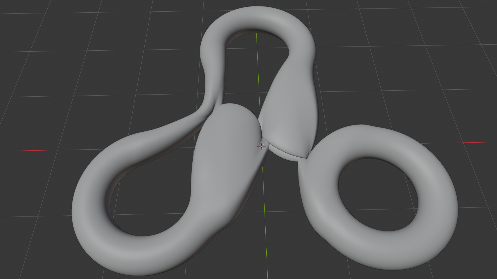

**The Fix:** I automated the generation of **Corrective Shape Keys** via Python. The script iterates through all necessary 2-way and 3-way overlaps, calculates the weighted blend of the vectors (rather than a naive addition), and produces a fix-key. These keys are prefixed with `C_` (e.g., `C_E1_E2`) so they are easy to target and activate in the web interface when the respective base shapes are blending.

```python
import bpy
from mathutils import Vector


def generate_corrective_keys():
    """Create corrective keys for compatible pinches with overlapping falloff."""

    obj = bpy.context.active_object
    shape_keys = obj.data.shape_keys.key_blocks

    # These pairs and triples are topologically compatible, but their
    # proportional-editing domains overlap in the genus-3 mesh.
    combinations = [
        ['E1', 'E2'],
        ['E1', 'E3'],
        ['E2', 'E3'],
        ['B12', 'B13'],
        ['B12', 'B23'],
        ['B13', 'B23'],
        ['H1*', 'E2'],
        ['H1*', 'E3'],
        ['H1*', 'B12'],
        ['H1*', 'B13'],
        ['E1', 'E2', 'E3'],
        ['B12', 'B13', 'B23'],
        ['H1*', 'E2', 'E3'],
        ['H1*', 'E2', 'B13'],
        ['H1*', 'B12', 'E3'],
        ['H1*', 'B12', 'B13'],
    ]

    # Squared deformation lengths favor the locally dominant base key. The
    # bulge term softens areas in which several keys contribute similarly.
    weight_exponent = 2.0
    bulge_factor = 0.15
    epsilon = 1e-6

    for shape_names in combinations:
        # Replace '*' with 's' in corrective-key names so they match the
        # identifiers expected by the application.
        correction_name = 'C_' + '_'.join(shape_names).replace('*', 's')

        if correction_name in shape_keys:
            obj.shape_key_remove(shape_keys[correction_name])

        corrective_key = obj.shape_key_add(
            name=correction_name,
            from_mix=False,
        )

        basis_vertices = shape_keys['Basis'].data
        target_vertices = [shape_keys[name].data for name in shape_names]
        correction_vertices = corrective_key.data
        shape_count = len(shape_names)
        equal_weight = 1.0 / shape_count

        for index in range(len(basis_vertices)):
            basis_position = basis_vertices[index].co
            deltas = [
                target[index].co - basis_position
                for target in target_vertices
            ]
            lengths = [delta.length for delta in deltas]
            total_weight = sum(
                length**weight_exponent for length in lengths
            )

            if total_weight < epsilon:
                correction_vertices[index].co = basis_position
                continue

            weights = [
                length**weight_exponent / total_weight
                for length in lengths
            ]

            # Blender already adds every base-key delta. The corrective key must
            # therefore contribute the desired weighted deformation minus that
            # additive result.
            weighted_delta = Vector((0, 0, 0))
            for weight, delta in zip(weights, deltas):
                weighted_delta += weight * delta

            summed_delta = Vector((0, 0, 0))
            for delta in deltas:
                summed_delta += delta

            correction_delta = weighted_delta - summed_delta

            if bulge_factor > 0.0:
                maximum_weight = max(weights)
                if maximum_weight < 1.0:
                    overlap = (1.0 - maximum_weight) / (
                        1.0 - equal_weight
                    )
                    # Smoothstep prevents abrupt changes near the edge of an
                    # overlapping proportional-editing domain.
                    overlap = overlap**2 * (3.0 - 2.0 * overlap)
                else:
                    overlap = 0.0

                correction_delta -= weighted_delta * (
                    bulge_factor * overlap
                )

            correction_vertices[index].co = (
                basis_position + correction_delta
            )

        print(f'Generated corrective key: {correction_name}')


if __name__ == '__main__':
    generate_corrective_keys()
```

Here is how the mesh looks after applying the corrective shape key:

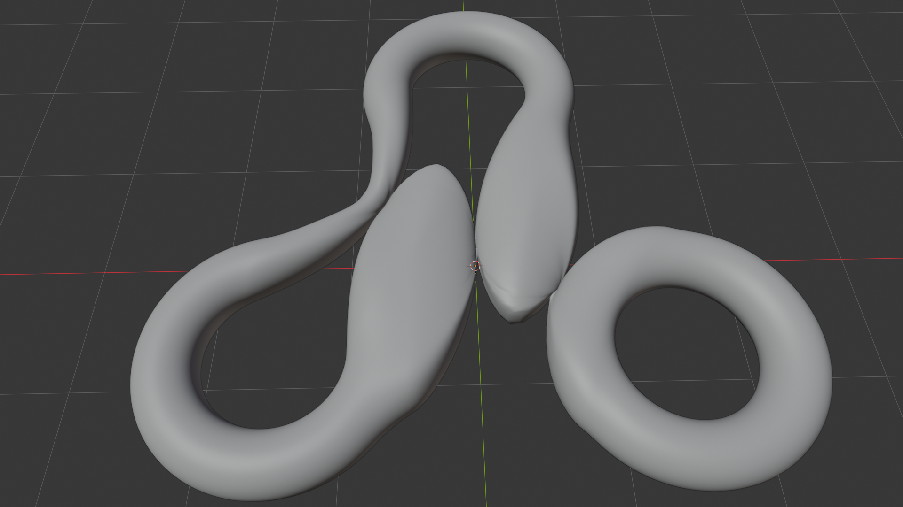

As you can see, while the geometry isn't mathematically flawless, the correction eliminates the extreme warping and is more than good enough for our web visualizer.

### 2.6 Exporting to GLB

Finally, export the model in exactly the same way as the Genus 2 surface. Make sure the export format is set to `.glb` and that the crucial **Shape Keys** option is checked in the export settings. Save the file, for example, as `surface_g3.glb`.
